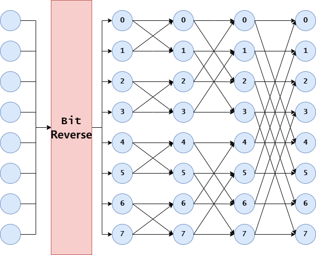
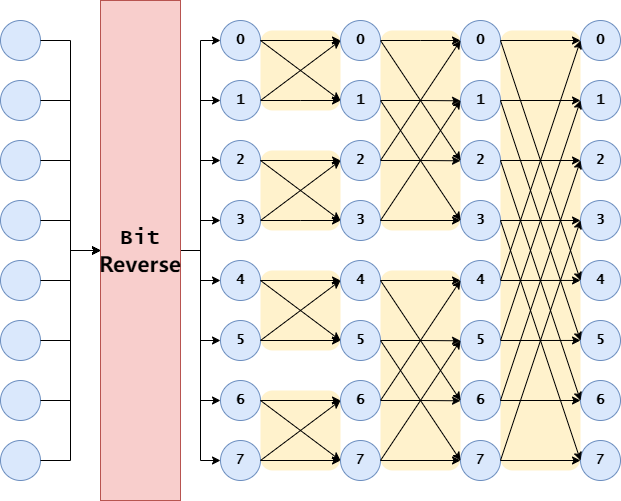

# FFT Optimizations
Implementations see:
* [python-implementation](./fft.ipynb)
## Get Started
Following posts may be helpful to get started:
* [An-Excursion-Into-FFT-p1](https://mecha-mind.medium.com/an-excursion-into-fast-fourier-transform-part-1-8a6498ee0c10)
    : This post gives an intro to FFT from the perspective of Time-Series
* [An-Excursion-Into-FFT-p2](https://mecha-mind.medium.com/an-excursion-into-fast-fourier-transform-part-2-81461f125880)
    : This post gives other applications of FFT like:
        * Polynomial Multiplication
        * Combinational Sum
        * Pattern Matching

You can also refer to CLRS(3rd Edition) Chapter 30 to get started.

## One Step Further
* [FFT-Kernel-Optimization](https://zhuanlan.zhihu.com/p/389325484)
    : This post from **ZhiHu** depicts the FFT picture well
      * It introduces high-radix Cooley-Turkey Algorithm
      * also cover inputs whose length is not power of 2

## My Path
### Understanding
Firstly, I read several blogs and some books to try to grasp the core idea of **Computing FFT**. In this stage, I write some implementation of FFT in python, with some help from **Monica AI** and **Jupyter Notebook**.

And finally, I find the **Iteration Model** helpful.
```python
def fft_iterative(x):
    N = len(x)
    # iterations needed
    logN = int(np.log2(N))

    # do bit-reverse
    indices = np.arange(N)
    bit_reversed_indices = [bit_reverse(i,logN) for i in range(N)]
    x = [x[i] for i in bit_reversed_indices]

    # FFT 
    for s in range(1, logN + 1):
        m = 1 << s 
        wm = np.exp(-2j * np.pi / m)  # 旋转因子
        for k in range(0, N, m):
            w = 1  # 初始化w
            for j in range(m // 2):
                t = w * x[k + j + m // 2]
                u = x[k + j]
                x[k + j] = u + t
                x[k + j + m // 2] = u - t
                w *= wm 

    return x
```

This motivates me to construct a scheme to calculate 1D-FFT:
  
* Padding 0 if necessary
* Perform **Bit Reverse** on the given array
* Perform **Butterfly Operation** on the reversed array.

It may look like the following picture:



### Cuda Implementation
We can directly parallel the calculation as the following picture depicts:



```cpp
__global__
void
fft_naive(cuFloatComplex* x, int n, int steps){
	int idx = blockIdx.x * blockDim.x + threadIdx.x;
	for (int stage = 0; stage < steps; ++stage){
		int numOfElem = 1 << (stage + 1);
		int xStart = idx * numOfElem;
		if (xStart < n){
			for(int k = 0; k < numOfElem/2; ++k){
				// Butterfly Operation
				float angle = -2.0f * M_PI * k / numOfElem;
				cuFloatComplex rotation = make_cuFloatComplex(cos(angle), sin(angle));

				cuFloatComplex even = x[xStart+k];
				cuFloatComplex odd = x[xStart + numOfElem/2 + k];
				cuFloatComplex twiddle = cuCmulf(rotation,odd);
				x[xStart+k] = cuCaddf(even,twiddle);
				x[xStart + numOfElem/2 + k] = cuCsubf(even, twiddle);  
			}
		}
		__syncthreads();
	}
}
```
